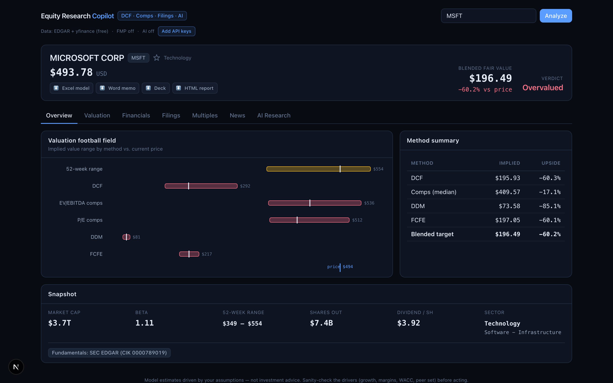
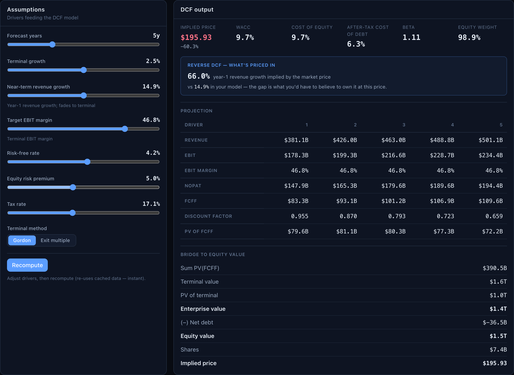

# Equity Research Automation

[](https://github.com/wcsmars/Equity-Valuation-Engine-with-Reverse-DCF/actions/workflows/tests.yml)

An equity valuation engine with a local research dashboard. It combines SEC
EDGAR fundamentals and Yahoo Finance market data, runs several valuation
methods, and exports the results to Excel and HTML. The dashboard adds editable
assumptions, filing analysis, saved research, and Word/PowerPoint exports.



*Dashboard screenshots: MSFT on live data with the default inputs, captured for
the September 2026 release. Live figures change with the market; the
reproducible offline example is under [Results](#results).*

## Highlights

- **Valuation engine written from scratch** in `equity_valuation/`: FCFF DCF with a
  mid-year convention and Gordon-growth or exit-multiple terminal value, CAPM cost
  of equity and WACC on market-value weights, trading comps with per-multiple
  outlier trimming, DDM and FCFE, two-way sensitivity grids, and a football-field
  summary.
- **Reverse DCF** (dashboard, `backend/valuation_service.py`): bisection on
  year-1 revenue growth to back out what the current share price implies, so the
  model answers "what do I have to believe?" as well as "what is it worth?".
- **EDGAR data layer**: XBRL company facts are normalized into annual statements
  keyed by reporting period rather than the XBRL fiscal-year field, so restated
  figures win and companies that switched tags still get a complete series.
  yfinance supplies prices, beta, and peer multiples and is the fundamentals
  fallback. Everything sits behind a `DataProvider` interface, which is why the
  models run offline on synthetic companies in the tests.
- **Fails soft**: a missing input becomes a note that reaches the dashboard and the
  exports instead of a crash, and every fallback the models take is recorded.
- **Stack**: Python 3.11 with pandas, requests, openpyxl, plotly, python-docx, and
  python-pptx; FastAPI; Next.js 15, React 19, TypeScript, and Tailwind; Electron;
  optional Anthropic API for the research assistant.

## Valuation workflow

| Component | Implementation |
| --- | --- |
| Data | EDGAR annual financials, yfinance prices and peer multiples; yfinance fundamentals as a fallback |
| DCF | Forecast FCFF, CAPM/WACC, Gordon-growth or exit-multiple terminal value, enterprise-to-equity bridge |
| Reverse DCF | Dashboard only: bisection on year-1 revenue growth to back out the growth rate implied by the current price |
| Comparables | Peer multiples, outlier trimming, median-based implied prices |
| DDM / FCFE | Dividend and equity cash-flow valuations discounted at cost of equity |
| Sensitivity | WACC/growth and margin/growth grids, plus valuation-range comparisons |
| Decision | Blended target = median of the available DCF, comps-median, DDM and FCFE implied prices (a method that could not value the company is left out, and a negative equity value counts as zero); verdict is Undervalued at +15% upside or more, Overvalued at -15% or less, otherwise Fairly valued |
| Research | Filing retrieval, notes, watchlist, optional source-linked AI summaries and assumption suggestions |
| Exports | Excel model, interactive HTML report, Word memo, PowerPoint briefing |

The median keeps one outlying method, such as a DDM on a low-payout stock, from
dragging the blended target. The data-provider interface lets the models run on
supplied data independently of the live APIs: `--demo` and the offline checks
use a synthetic dividend-paying company, and the checks add a distressed company
to exercise negative equity values.

## Run the valuation engine

Use Python 3.11 or newer. Run these commands from this directory. The `--demo`
run needs no network access or API keys:

```bash
python3 -m venv .venv
source .venv/bin/activate
python -m pip install -r requirements.txt
python -m equity_valuation --demo
```

`--demo` values the synthetic company in `equity_valuation/data/synthetic.py`
against three synthetic peers and writes `output/SYNT_valuation.xlsx` and
`output/SYNT_valuation.html`. For a live ticker, set an EDGAR contact first:

```bash
export SEC_USER_AGENT='equity-research your.email@example.com'
python -m equity_valuation AAPL --peers MSFT,GOOGL,META,AMZN
```

Replace the example contact with your own before requesting EDGAR data. Peers
are not auto-discovered; pass them with `--peers`, otherwise comps are skipped.
The CLI reads environment variables; it does not automatically load `.env`.
Without `SEC_USER_AGENT`, EDGAR is skipped and the valuation provider attempts
its yfinance fallback. No API key is needed for these two data sources.

```bash
python -m equity_valuation MSFT --peers AAPL,GOOGL,META,AMZN \
  --rf 0.043 --erp 0.05 --terminal-growth 0.025 --forecast-years 6
python -m equity_valuation NVDA --terminal-method exit_multiple \
  --exit-ev-ebitda 18 --html
python -m equity_valuation --help
```

Exports go to `output/` by default. Use `--out DIR` to choose another directory.
With no export flag both files are written; `--excel` or `--html` alone writes
only that format.
The Excel DCF sheet contains formulas for selected calculations; other model
outputs are snapshots. The HTML report embeds its chart library for offline use.
Rates are decimals (`--rf 0.043` means 4.3%); percent-style, non-finite or
out-of-range values are rejected. `--terminal-growth` applies to the DCF, DDM
and FCFE. The command exits 1 if the valuation or an export fails and 2 for
invalid arguments.

## Run the dashboard

The dashboard also needs Node.js 22.12 or newer and npm.

```bash
cp .env.example .env
# Edit .env: set your SEC contact and any optional API keys.
./run_dev.sh
```

Open `http://127.0.0.1:3000`. The script installs Python dependencies, installs
frontend packages from the lockfile on first run, and starts FastAPI and Next.js.
Press Ctrl-C to stop both servers.



| Setting | Purpose |
| --- | --- |
| `SEC_USER_AGENT` | Application name and contact email for EDGAR requests |
| `FMP_API_KEY` | Optional Financial Modeling Prep news, estimates, ratios, and transcripts; coverage depends on the account plan |
| `ANTHROPIC_API_KEY` | Optional research summaries, chat, and research notes |
| `ANTHROPIC_MODEL` | Optional override of the model used by the research service |

The research assistant sends supplied text, PDFs, and valuation context to
Anthropic when invoked. Its suggestions require user review before applying
them to the model. Saved watchlists and notes stay in `data/copilot_store.json`;
that file, API keys, and generated exports are ignored by Git.

For manual startup after installing both Python requirement files and running
`npm ci` in `frontend/`:

```bash
set -a; source .env; set +a
.venv/bin/python -m uvicorn backend.app:app --host 127.0.0.1 --port 8000
# In another terminal:
cd frontend
npm run dev -- --hostname 127.0.0.1
```

A macOS Electron wrapper is in [desktop/](desktop/README.md). It runs the
backend with the project's `.venv` Python. Source runs serve the frontend with
Electron's bundled Node runtime; a packaged local app uses the Node executable
captured when it was built (`ERC_NODE_PATH` overrides either). It depends on
this checkout and is not a standalone distribution.

## Results

The offline demo is deterministic, so these figures reproduce exactly with
`python -m equity_valuation --demo` (the default inputs: risk-free rate 4.2%,
equity risk premium 5%, five forecast years, 2.5% terminal growth).
`tests/test_exports.py` pins them. Synthetic Corp's revenue grows 8% a year from
$80B in FY2020 to $108.8B in FY2024, the base year the models value from. It has
a 25% EBIT margin, a 30% payout, $12B of net debt, a beta of 1.1, and a share
price set at 20x trailing earnings.

| Method | Implied price | vs. $40.84 price |
| --- | ---: | ---: |
| DCF (FCFF, WACC 9.5%) | $33.38 | -18.3% |
| Comps (median of five peer multiples) | $42.88 | +5.0% |
| DDM | $10.99 | -73.1% |
| FCFE | $31.41 | -23.1% |
| **Blended target (median)** | **$32.40** | **-20.7%, Overvalued** |

Terminal value is 73% of the DCF enterprise value. The dashboard's reverse DCF
(also run in `tests/test_exports.py`) shows why the model calls the stock
expensive: holding the other inputs fixed, the price implies about 17.5% year-1
revenue growth fading to terminal, against 8% historical growth. The DDM sits
far below the other methods because it values only the 30% of earnings paid out
as dividends, which is the case the median guards against. These are model
outputs on made-up data, not a forecast or a track record.

## Offline checks

```bash
python -m pip install -r requirements.txt -r backend/requirements-backend.txt
python -m tests.test_synthetic
python -m unittest discover -s tests -p 'test_*.py'
cd frontend
npm ci
npm run build
```

The synthetic script checks WACC bounds, valuation identities, sensitivity
monotonicity, and ordered valuation ranges including negative-value cases. The
unittest suite pins the CAPM/WACC, DCF terminal-value, discounting, equity-bridge,
and DDM formulas on the synthetic company, checks the EDGAR annual-series
normalizer on a hand-built filing payload (restatements, tag changes, 53-week
years, non-annual forms), and checks settings persistence and local-origin
restrictions. The export tests write the Excel, HTML, Word and PowerPoint
outputs for the synthetic company, confirm the demo figures above, and check
that the reverse-DCF growth reprices the stock to within one cent. Further
tests cover model edge cases (missing market cap, zero-filled statement lines,
negative book equity, clamped sensitivity cells), that the Excel formulas
reconcile to the model, the CLI's input checks, and the API: host checks,
assumption validation, AI requests against a mocked client, and store recovery.
These checks do not establish live data accuracy or investment performance.

## Project layout

```text
equity_valuation/   Data providers, valuation models, CLI, Excel/HTML exporters
backend/           FastAPI routes, research integration, persistence, exports
frontend/          Next.js / React dashboard
desktop/           Electron wrapper for local macOS use
tests/             Offline model, data, report, export, API, and settings checks
```

This is a local, single-user research tool without authentication. Live data can
be missing, stale, or rate-limited, and foreign-company coverage is less complete.
Default macro inputs are illustrative assumptions rather than current market
estimates; with them, the five-year Gordon-growth DCF is deliberately
conservative and tends to flag mega-cap growth names as overvalued, so use the
rate, growth, and exit-multiple flags and the sensitivity grid to explore the
range. Review source data, peer selection, and assumptions before relying on
any valuation; model outputs and generated research are not investment advice.
